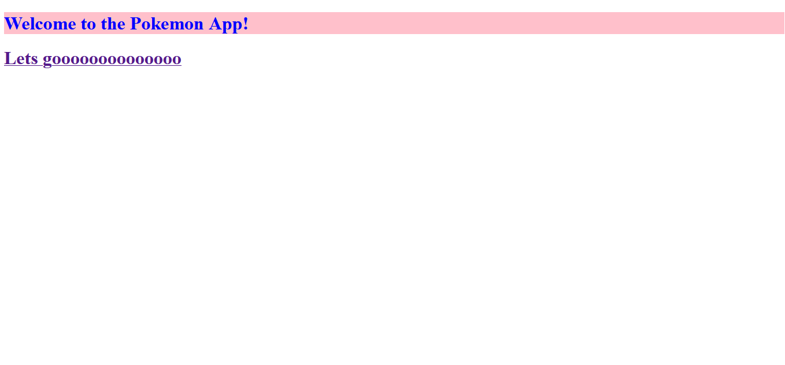
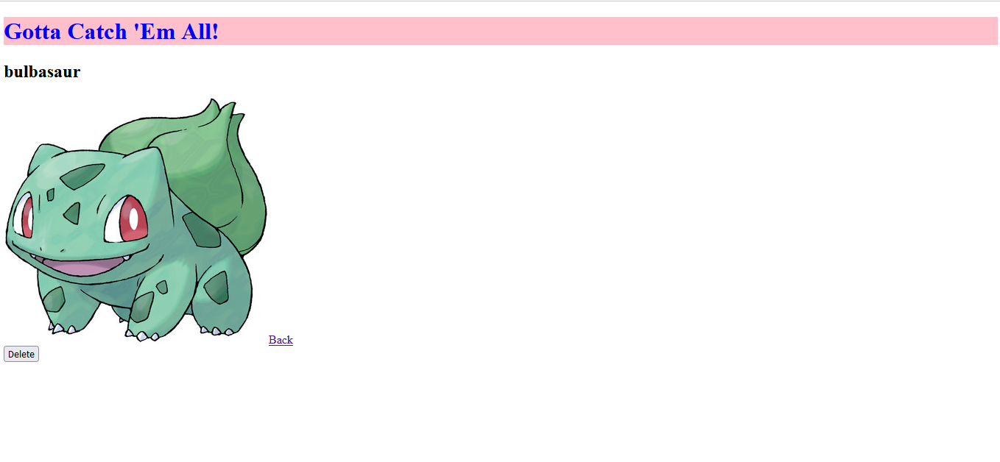
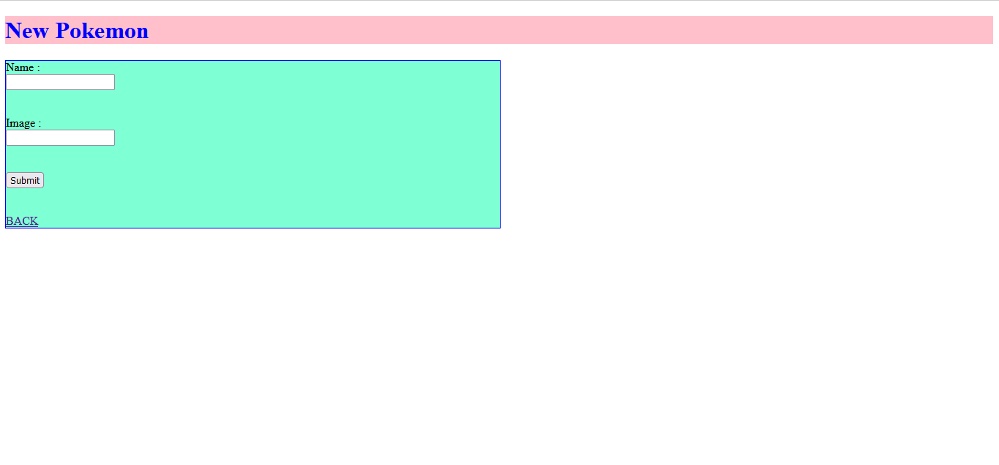

# Welcome to POKEMON app

A Pokemon app that displays data inside server-side rendered views.

-  Practicing index and show, new and create routes with express

- Using
    - JavaScript
    - Express
    - Node
    - JSX

# Link to the app ,

https://pokeman-app.onrender.com/

# User Stories
-   When a user goes to the /pokemon route they will see an index of pokemon: the names of each pokemon rendered to the page.
-   When a user clicks on the name of the pokemon, they will be taken to that pokemon's showpage, and will see the pokemon's name and image.
-   When a user goes to /pokemon/new a user sees a form that allows them to create a brand new pokemon, and then redirects the user back to /pokemon

# Homepage

# Indexpage

# Showpage

# Newpage

